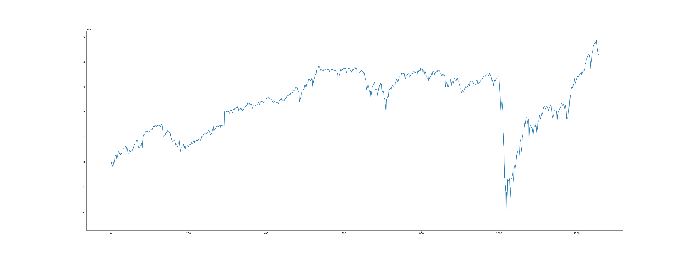
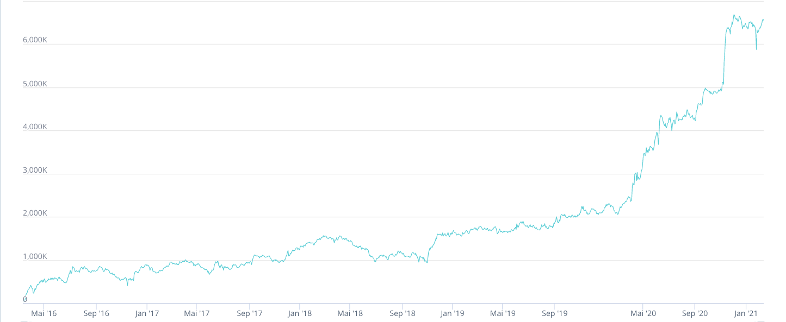

# WorldQuant BRAIN Simulator

> **Help Wanted**: See issue [#3](https://github.com/efJerryYang/worldquant-brain-simulator/issues/3) for more details.

## Introduction

This is a simulator to help with backtesting your alphas offline for platform WorldQuant Brain

## Demo

Some problems exist (data, expressions, procedure), so the results are still different from the platform's.





> Totol time cost is about 20 minutes on one core, target is 5 minutes per core.

## Project Structure

```sh
worldquant-brain-simulator/
|-- alpha
|-- data
|   |-- stock_snowball_us.db
|   `-- stock_snowball_us_full.db.tar.gz
|-- history
|-- LICENSE
|-- README.md
|-- requirements.txt
|-- src
|   `-- simulator
|       |-- alpha101.py
|       |-- database.py
|       |-- expression.py
|       |-- fetch.py
|       |-- __init__.py
|       |-- settings.yaml
|       `-- simulate.py
`-- test
```

## Todos

- [ ] Too slow, is it possible for Python to be faster?

- [x] Examine the data => There are truly some problems with data from Snowball. Differences detected when computing the `vwap`.
- [ ] Examine the procedure
- [ ] Examine the fast-expression implementation

- [ ] Add docs to code
- [ ] Do not use string date
- [x] Change `date` and `next_day` to `prev_day` and `today`
- [ ] Truncation correctness (current not necessarily working)

- [x] Implement multiprocessing

## References

- The fast expression and Alpha 101 implementation: [WorldQuant_alpha101_code](https://github.com/yli188/WorldQuant_alpha101_code)

<!-- 
actual dependencies:
```
pip install numpy pandas scipy polars pipreqs ruff
 -->