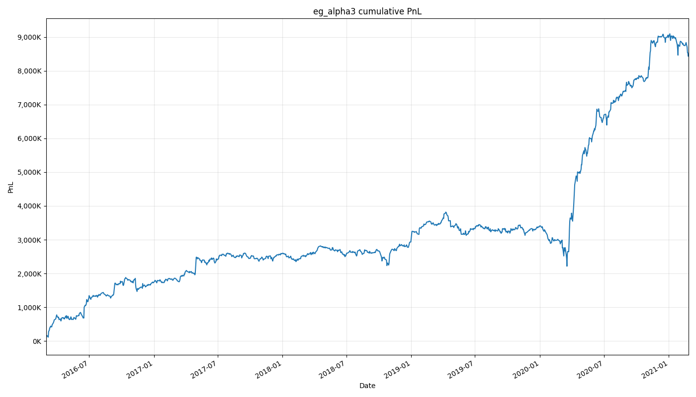
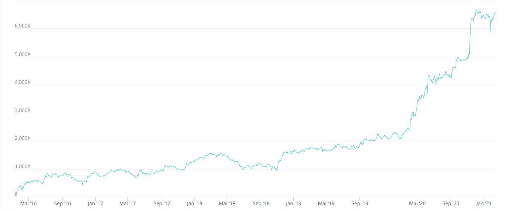

# WorldQuant BRAIN Simulator

<!-- > **Help Wanted**: See issue [#3](https://github.com/efJerryYang/worldquant-brain-simulator/issues/3) for more details. -->

## Introduction

This is a simulator to help with backtesting your alphas offline for platform WorldQuant Brain

## Demo

Some problems exist (data, expressions, procedure), so the results are still different from the platform's.




<!-- 
> Totol time cost is about 20 minutes on one core, target is 5 minutes per core. -->

## Project Structure

```sh
worldquant-brain-simulator/
|-- data
|   `-- stock_snowball_us.db
|-- docs
|-- LICENSE
|-- README.md
|-- pyproject.toml
|-- uv.lock
|-- tests
`-- src
    |-- wqsim
    |   |-- alphas.py
    |   |-- cli.py
    |   |-- config.py
    |   |-- data.py
    |   |-- fast_expr.py
    |   |-- simulator.py
    |   `-- __init__.py
    |-- main.py
```

## Usage

This rewrite uses `uv` and Python 3.14.

```sh
uv run wqsim alphas
uv run wqsim run --alpha eg_alpha3 --sample test --output-dir tmp
uv run pytest
```

The new runtime loads SQLite data with Polars, converts it into dense NumPy panels, evaluates alpha functions in batch, and writes cumulative PnL figures from the CLI.
<!-- 
## Todos

- [ ] Too slow, is it possible for Python to be faster?

- [x] Examine the data => There are truly some problems with data from Snowball. Differences detected when computing the `vwap`.
- [ ] Examine the procedure
- [ ] Examine the fast-expression implementation

- [ ] Add docs to code
- [ ] Do not use string date
- [x] Change `date` and `next_day` to `prev_day` and `today`
- [ ] Truncation correctness (current not necessarily working)

- [x] Implement multiprocessing -->

## References

- The fast expression and Alpha 101 implementation: [WorldQuant_alpha101_code](https://github.com/yli188/WorldQuant_alpha101_code)

<!-- 
actual dependencies:
```
pip install numpy pandas scipy polars pipreqs ruff
 -->
